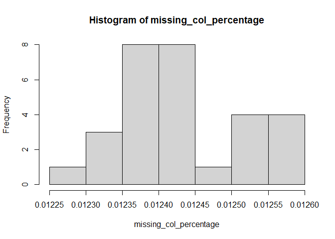
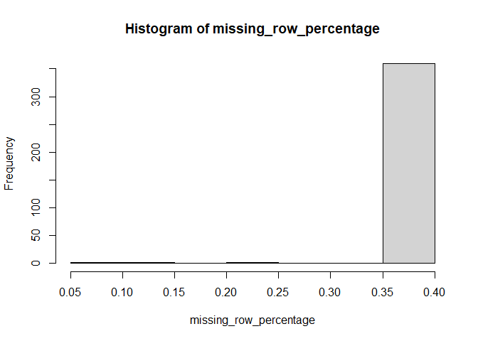

MicroarrayRNAPMID33712379
================
Cindy Zhang
2023-02-19

### Loading Data

``` r
eset <- getGEO("GSE41762", getGPL = FALSE)[[1]]
```

    ## Found 1 file(s)

    ## GSE41762_series_matrix.txt.gz

``` r
eset
```

    ## ExpressionSet (storageMode: lockedEnvironment)
    ## assayData: 29096 features, 77 samples 
    ##   element names: exprs 
    ## protocolData: none
    ## phenoData
    ##   sampleNames: GSM1023655 GSM1023656 ... GSM1023731 (77 total)
    ##   varLabels: title geo_accession ... tissue:ch1 (40 total)
    ##   varMetadata: labelDescription
    ## featureData: none
    ## experimentData: use 'experimentData(object)'
    ##   pubMedIds: 23140642
    ## 25298321 
    ## Annotation: GPL6244

### Examine MetaData

``` r
str(pData(eset))
```

    ## 'data.frame':    77 obs. of  40 variables:
    ##  $ title                  : chr  "human islets, ID1" "human islets, ID2" "human islets, ID3" "human islets, ID4" ...
    ##  $ geo_accession          : chr  "GSM1023655" "GSM1023656" "GSM1023657" "GSM1023658" ...
    ##  $ status                 : chr  "Public on Oct 23 2012" "Public on Oct 23 2012" "Public on Oct 23 2012" "Public on Oct 23 2012" ...
    ##  $ submission_date        : chr  "Oct 22 2012" "Oct 22 2012" "Oct 22 2012" "Oct 22 2012" ...
    ##  $ last_update_date       : chr  "Oct 23 2012" "Oct 23 2012" "Oct 23 2012" "Oct 23 2012" ...
    ##  $ type                   : chr  "RNA" "RNA" "RNA" "RNA" ...
    ##  $ channel_count          : chr  "1" "1" "1" "1" ...
    ##  $ source_name_ch1        : chr  "Islets from cadaver donor ID1" "Islets from cadaver donor ID2" "Islets from cadaver donor ID3" "Islets from cadaver donor ID4" ...
    ##  $ organism_ch1           : chr  "Homo sapiens" "Homo sapiens" "Homo sapiens" "Homo sapiens" ...
    ##  $ characteristics_ch1    : chr  "tissue: pancreatic islets" "tissue: pancreatic islets" "tissue: pancreatic islets" "tissue: pancreatic islets" ...
    ##  $ characteristics_ch1.1  : chr  "Sex: Male" "Sex: Male" "Sex: Female" "Sex: Female" ...
    ##  $ characteristics_ch1.2  : chr  "age: 69" "age: 56" "age: 46" "age: 62" ...
    ##  $ characteristics_ch1.3  : chr  "bmi: 24.7" "bmi: 24.7" "bmi: 23.9" "bmi: 27.7" ...
    ##  $ characteristics_ch1.4  : chr  "hba1c: 5.8" "status: Non-diabetic donor" "hba1c: 5.4" "status: Non-diabetic donor" ...
    ##  $ characteristics_ch1.5  : chr  "status: Non-diabetic donor" "" "status: Non-diabetic donor" "" ...
    ##  $ treatment_protocol_ch1 : chr  "The islets were cultured in CMRL 1066 (ICN Biomedicals, Costa Mesa, CA, USA) supplemented with 10 mM/l HEPES, 2"| __truncated__ "The islets were cultured in CMRL 1066 (ICN Biomedicals, Costa Mesa, CA, USA) supplemented with 10 mM/l HEPES, 2"| __truncated__ "The islets were cultured in CMRL 1066 (ICN Biomedicals, Costa Mesa, CA, USA) supplemented with 10 mM/l HEPES, 2"| __truncated__ "The islets were cultured in CMRL 1066 (ICN Biomedicals, Costa Mesa, CA, USA) supplemented with 10 mM/l HEPES, 2"| __truncated__ ...
    ##  $ molecule_ch1           : chr  "total RNA" "total RNA" "total RNA" "total RNA" ...
    ##  $ extract_protocol_ch1   : chr  "Total RNA was isolated with the AllPrep DNA/RNA Mini Kit (Qiagen, Hilden, Germany). RNA quality and concentrati"| __truncated__ "Total RNA was isolated with the AllPrep DNA/RNA Mini Kit (Qiagen, Hilden, Germany). RNA quality and concentrati"| __truncated__ "Total RNA was isolated with the AllPrep DNA/RNA Mini Kit (Qiagen, Hilden, Germany). RNA quality and concentrati"| __truncated__ "Total RNA was isolated with the AllPrep DNA/RNA Mini Kit (Qiagen, Hilden, Germany). RNA quality and concentrati"| __truncated__ ...
    ##  $ label_ch1              : chr  "biotin" "biotin" "biotin" "biotin" ...
    ##  $ label_protocol_ch1     : chr  "Briefly, 100-200 ng total RNA was processed as indicated by GeneChip® Expression 3’-Amplification Reagents Onec"| __truncated__ "Briefly, 100-200 ng total RNA was processed as indicated by GeneChip® Expression 3’-Amplification Reagents Onec"| __truncated__ "Briefly, 100-200 ng total RNA was processed as indicated by GeneChip® Expression 3’-Amplification Reagents Onec"| __truncated__ "Briefly, 100-200 ng total RNA was processed as indicated by GeneChip® Expression 3’-Amplification Reagents Onec"| __truncated__ ...
    ##  $ taxid_ch1              : chr  "9606" "9606" "9606" "9606" ...
    ##  $ hyb_protocol           : chr  "Following fragmentation, 10 ug of cRNA were hybridized onto the GeneChip® Human Gene 1.0 ST whole transcript ba"| __truncated__ "Following fragmentation, 10 ug of cRNA were hybridized onto the GeneChip® Human Gene 1.0 ST whole transcript ba"| __truncated__ "Following fragmentation, 10 ug of cRNA were hybridized onto the GeneChip® Human Gene 1.0 ST whole transcript ba"| __truncated__ "Following fragmentation, 10 ug of cRNA were hybridized onto the GeneChip® Human Gene 1.0 ST whole transcript ba"| __truncated__ ...
    ##  $ scan_protocol          : chr  "Scanning was carried out with the GeneChip® Scanner 3000 and image analysis was performed using GeneChip® Operating Software." "Scanning was carried out with the GeneChip® Scanner 3000 and image analysis was performed using GeneChip® Operating Software." "Scanning was carried out with the GeneChip® Scanner 3000 and image analysis was performed using GeneChip® Operating Software." "Scanning was carried out with the GeneChip® Scanner 3000 and image analysis was performed using GeneChip® Operating Software." ...
    ##  $ description            : chr  "Gene expression data from human pancreatic islets" "Gene expression data from human pancreatic islets" "Gene expression data from human pancreatic islets" "Gene expression data from human pancreatic islets" ...
    ##  $ data_processing        : chr  "The array data was summarized and normalized with Robust Multi-array Analysis (RMA) method using the software “"| __truncated__ "The array data was summarized and normalized with Robust Multi-array Analysis (RMA) method using the software “"| __truncated__ "The array data was summarized and normalized with Robust Multi-array Analysis (RMA) method using the software “"| __truncated__ "The array data was summarized and normalized with Robust Multi-array Analysis (RMA) method using the software “"| __truncated__ ...
    ##  $ platform_id            : chr  "GPL6244" "GPL6244" "GPL6244" "GPL6244" ...
    ##  $ contact_name           : chr  "Anders,,Rosengren" "Anders,,Rosengren" "Anders,,Rosengren" "Anders,,Rosengren" ...
    ##  $ contact_institute      : chr  "Lund University" "Lund University" "Lund University" "Lund University" ...
    ##  $ contact_address        : chr  "CRC 91-11 SUS" "CRC 91-11 SUS" "CRC 91-11 SUS" "CRC 91-11 SUS" ...
    ##  $ contact_city           : chr  "Malmo" "Malmo" "Malmo" "Malmo" ...
    ##  $ contact_zip/postal_code: chr  "SE-20502" "SE-20502" "SE-20502" "SE-20502" ...
    ##  $ contact_country        : chr  "Sweden" "Sweden" "Sweden" "Sweden" ...
    ##  $ supplementary_file     : chr  "ftp://ftp.ncbi.nlm.nih.gov/geo/samples/GSM1023nnn/GSM1023655/suppl/GSM1023655_1.CEL.gz" "ftp://ftp.ncbi.nlm.nih.gov/geo/samples/GSM1023nnn/GSM1023656/suppl/GSM1023656_2.CEL.gz" "ftp://ftp.ncbi.nlm.nih.gov/geo/samples/GSM1023nnn/GSM1023657/suppl/GSM1023657_3.CEL.gz" "ftp://ftp.ncbi.nlm.nih.gov/geo/samples/GSM1023nnn/GSM1023658/suppl/GSM1023658_4.CEL.gz" ...
    ##  $ data_row_count         : chr  "29096" "29096" "29096" "29096" ...
    ##  $ age:ch1                : chr  "69" "56" "46" "62" ...
    ##  $ bmi:ch1                : chr  "24.7" "24.7" "23.9" "27.7" ...
    ##  $ hba1c:ch1              : chr  "5.8" NA "5.4" NA ...
    ##  $ Sex:ch1                : chr  "Male" "Male" "Female" "Female" ...
    ##  $ status:ch1             : chr  "Non-diabetic donor" "Non-diabetic donor" "Non-diabetic donor" "Non-diabetic donor" ...
    ##  $ tissue:ch1             : chr  "pancreatic islets" "pancreatic islets" "pancreatic islets" "pancreatic islets" ...

``` r
#examine the first few rows and columns
head(pData(eset)[1:3,1:5]) %>% kable(align="ccccc")
```

|            |       title       | geo_accession |        status         | submission_date | last_update_date |
|:-----------|:-----------------:|:-------------:|:---------------------:|:---------------:|:----------------:|
| GSM1023655 | human islets, ID1 |  GSM1023655   | Public on Oct 23 2012 |   Oct 22 2012   |   Oct 23 2012    |
| GSM1023656 | human islets, ID2 |  GSM1023656   | Public on Oct 23 2012 |   Oct 22 2012   |   Oct 23 2012    |
| GSM1023657 | human islets, ID3 |  GSM1023657   | Public on Oct 23 2012 |   Oct 22 2012   |   Oct 23 2012    |

### Data Wrangling

``` r
pData(eset) <- pData(eset) %>%
  mutate(sample_id = geo_accession) %>% 
  select("status:ch1",sample_id,"Sex:ch1", "bmi:ch1", "age:ch1") 
colnames(pData(eset)) <- c("statu","sample_id","sex","bmi","age")

pData(eset)$bmi %>% as.double()
```

    ##  [1] 24.7 24.7 23.9 27.7 17.6 28.4 21.1 27.0 29.0 26.1 26.1 29.4 26.8 26.2 28.4
    ## [16] 26.0 24.7 23.9 22.5 26.2 29.1 21.1 22.0 27.5 24.2 36.6 26.3 26.2 26.3 29.4
    ## [31] 24.5 27.8 28.4 26.1 26.2 27.0 24.8 24.5 22.5 23.1 22.9 21.5 20.1 23.4 23.5
    ## [46] 27.5 24.8 33.1 34.6 25.7 23.7 24.7 24.6 27.0 19.4 26.0 33.6 24.7 36.9 32.5
    ## [61] 25.3 28.7 34.2 25.7 23.9 33.4 24.8 24.9 26.3 23.2 22.5 24.9 30.5 24.5 24.2
    ## [76] 31.1 26.0

``` r
pData(eset)$age %>% as.double()
```

    ##  [1] 69 56 46 62 69 67 62 51 54 60 51 44 64 73 54 31 61 57 55 63 71 26 54 43 43
    ## [26] 59 61 57 59 61 49 54 64 69 52 54 51 32 41 74 46 68 69 54 59 56 62 75 57 53
    ## [51] 57 61 60 64 67 64 56 40 62 57 62 43 66 58 67 49 52 51 35 54 69 66 64 68 61
    ## [76] 40 65

``` r
pData(eset) <- pData(eset) %>% 
  mutate(status = case_when(
         grepl("Non-diabetic donor", statu) ~ "nont2d",
         grepl("Diabetic donor", statu) ~ "t2d")) %>%
  mutate(BMI = case_when(
    bmi >  30 ~ "over30",
    bmi < 30 ~ "below30"
  )) %>% 
  select(-c(bmi,statu))


pData(eset) %>% 
  with(table(status,BMI))
```

    ##         BMI
    ## status   below30 over30
    ##   nont2d      53      4
    ##   t2d         14      6

### Arrange factor levels

``` r
pData(eset) <- pData(eset) %>% 
  mutate(BMI = fct_relevel(BMI, "below30", "over30")) %>% 
  mutate(status = as.factor(status))

pData(eset)$BMI
```

    ##  [1] below30 below30 below30 below30 below30 below30 below30 below30 below30
    ## [10] below30 below30 below30 below30 below30 below30 below30 below30 below30
    ## [19] below30 below30 below30 below30 below30 below30 below30 over30  below30
    ## [28] below30 below30 below30 below30 below30 below30 below30 below30 below30
    ## [37] below30 below30 below30 below30 below30 below30 below30 below30 below30
    ## [46] below30 below30 over30  over30  below30 below30 below30 below30 below30
    ## [55] below30 below30 over30  below30 over30  over30  below30 below30 over30 
    ## [64] below30 below30 over30  below30 below30 below30 below30 below30 below30
    ## [73] over30  below30 below30 over30  below30
    ## Levels: below30 over30

``` r
pData(eset)$status
```

    ##  [1] nont2d nont2d nont2d nont2d nont2d nont2d nont2d nont2d nont2d nont2d
    ## [11] t2d    t2d    nont2d nont2d nont2d nont2d nont2d t2d    nont2d nont2d
    ## [21] nont2d nont2d nont2d nont2d nont2d t2d    nont2d nont2d t2d    nont2d
    ## [31] nont2d nont2d t2d    nont2d nont2d t2d    nont2d nont2d t2d    t2d   
    ## [41] nont2d nont2d nont2d nont2d nont2d nont2d nont2d t2d    t2d    nont2d
    ## [51] nont2d t2d    nont2d t2d    nont2d nont2d nont2d nont2d t2d    t2d   
    ## [61] t2d    t2d    t2d    nont2d nont2d nont2d nont2d nont2d nont2d nont2d
    ## [71] nont2d t2d    nont2d t2d    nont2d nont2d nont2d
    ## Levels: nont2d t2d

### Do sample ID in sample metadata match the sample ID in expression matrix?

``` r
identical(colnames(exprs(eset)), pData(eset)$sample_id)
```

    ## [1] TRUE

### pivot data to longer format

``` r
toLonger <- function(expressionMatrix) {
    expressionMatrix <- longExpressionMatrix <- expressionMatrix %>% 
    as.data.frame() %>%
    rownames_to_column("gene") %>%
    pivot_longer(cols = !gene, 
                 values_to = "Expression",
                 names_to = "sample_id") 
  return(expressionMatrix)
}

head(toLonger(exprs(eset)),3)
```

    ## # A tibble: 3 × 3
    ##   gene    sample_id  Expression
    ##   <chr>   <chr>           <dbl>
    ## 1 7896736 GSM1023655       4.47
    ## 2 7896736 GSM1023656       4.91
    ## 3 7896736 GSM1023657       5.45

``` r
dev.off()
```

    ## null device 
    ##           1

``` r
toLonger(exprs(eset)) %>% 
  ggplot(aes(x=sample_id, y= Expression, color=sample_id)) +
  geom_boxplot() + 
  theme(axis.text.x = element_text(angle = 90, hjust = 1)) + 
  labs(x = "sample", y = "Gene Expression")
```

    ## Warning: Removed 10495 rows containing non-finite values (`stat_boxplot()`).

### Check for NA in count matrix and metaData

``` r
# NA in expression matrix
sum(is.na(exprs(eset)))
```

    ## [1] 10495

``` r
# NA in metadata
sum(is.na(pData(eset)))
```

    ## [1] 0

``` r
a <- exprs(eset) %>% 
  as.data.frame() %>% 
  mutate(sum = rowSums(.)) %>% 
  filter(sum != "NA")
#How many columns contain NA
expression <- exprs(eset) %>% data.frame()

length(names(which(colSums(is.na(expression))>0)))
```

    ## [1] 29

``` r
#What percentage of each (sample) column contain NA?
missing_col_percentage <- apply(expression[,which(colSums(is.na(expression))>0)], 2, function(x) sum(is.na(x))/29096)
head(missing_col_percentage, 5)
```

    ## GSM1023703 GSM1023704 GSM1023705 GSM1023706 GSM1023707 
    ## 0.01226973 0.01230410 0.01233847 0.01233847 0.01237283

``` r
hist(missing_col_percentage)
```

<!-- -->

``` r
min(missing_col_percentage)
```

    ## [1] 0.01226973

``` r
summary(missing_col_percentage)
```

    ##    Min. 1st Qu.  Median    Mean 3rd Qu.    Max. 
    ## 0.01227 0.01237 0.01244 0.01244 0.01251 0.01258

``` r
#How many genes(rows) contain NA?
length(names(which(rowSums(is.na(expression))>0)))
```

    ## [1] 366

``` r
#What percentage of each (gene) row contain NA?
missing_row_percentage <- apply(expression[which(rowSums(is.na(expression))>0),], 1, function(x) sum(is.na(x))/77)
head(missing_row_percentage,5)
```

    ##   7896985   7899534   7899753   7900235   7900382 
    ## 0.3766234 0.3766234 0.3766234 0.3766234 0.3766234

``` r
hist(missing_row_percentage)
```

<!-- -->

``` r
summary(missing_row_percentage)
```

    ##    Min. 1st Qu.  Median    Mean 3rd Qu.    Max. 
    ## 0.05195 0.37662 0.37662 0.37240 0.37662 0.37662

``` r
# Mean expression for the genes with missing values
na_id <- as.list(names(which(rowSums(is.na(expression))>0)))
mean_expression_na <- expression %>%
  mutate(avg = rowMeans(.,na.rm=TRUE)) %>% 
  rownames_to_column(var="id") %>% 
  filter(id %in% na_id) %>% 
  select(avg)
mean_expression_complete <- expression %>%
  mutate(avg = rowMeans(.,na.rm=TRUE)) %>% 
  rownames_to_column(var="id") %>% 
  filter(!(id %in% na_id)) %>% 
  select(avg)
par(mfrow=c(1,2))
#Does the genes with missing values have a higher average experssion than genes without any missing values?
mean(mean_expression_na$avg)
```

    ## [1] 7.629906

``` r
mean(mean_expression_complete$avg)
```

    ## [1] 5.869807

``` r
imputed <- impute.knn(as.matrix(expression),k = 10, rowmax = 0.5, colmax = 0.8, maxp = 1500, rng.seed=362436069)
```

    ## Cluster size 29096 broken into 14792 14304 
    ## Cluster size 14792 broken into 8433 6359 
    ## Cluster size 8433 broken into 4293 4140 
    ## Cluster size 4293 broken into 2014 2279 
    ## Cluster size 2014 broken into 1969 45 
    ## Cluster size 1969 broken into 1041 928 
    ## Done cluster 1041 
    ## Done cluster 928 
    ## Done cluster 1969 
    ## Done cluster 45 
    ## Done cluster 2014 
    ## Cluster size 2279 broken into 1185 1094 
    ## Done cluster 1185 
    ## Done cluster 1094 
    ## Done cluster 2279 
    ## Done cluster 4293 
    ## Cluster size 4140 broken into 1723 2417 
    ## Cluster size 1723 broken into 1539 184 
    ## Cluster size 1539 broken into 779 760 
    ## Done cluster 779 
    ## Done cluster 760 
    ## Done cluster 1539 
    ## Done cluster 184 
    ## Done cluster 1723 
    ## Cluster size 2417 broken into 1183 1234 
    ## Done cluster 1183 
    ## Done cluster 1234 
    ## Done cluster 2417 
    ## Done cluster 4140 
    ## Done cluster 8433 
    ## Cluster size 6359 broken into 3049 3310 
    ## Cluster size 3049 broken into 1467 1582 
    ## Done cluster 1467 
    ## Cluster size 1582 broken into 752 830 
    ## Done cluster 752 
    ## Done cluster 830 
    ## Done cluster 1582 
    ## Done cluster 3049 
    ## Cluster size 3310 broken into 1681 1629 
    ## Cluster size 1681 broken into 59 1622 
    ## Done cluster 59 
    ## Cluster size 1622 broken into 902 720 
    ## Done cluster 902 
    ## Done cluster 720 
    ## Done cluster 1622 
    ## Done cluster 1681 
    ## Cluster size 1629 broken into 874 755 
    ## Done cluster 874 
    ## Done cluster 755 
    ## Done cluster 1629 
    ## Done cluster 3310 
    ## Done cluster 6359 
    ## Done cluster 14792 
    ## Cluster size 14304 broken into 9443 4861 
    ## Cluster size 9443 broken into 4704 4739 
    ## Cluster size 4704 broken into 2411 2293 
    ## Cluster size 2411 broken into 1260 1151 
    ## Done cluster 1260 
    ## Done cluster 1151 
    ## Done cluster 2411 
    ## Cluster size 2293 broken into 1188 1105 
    ## Done cluster 1188 
    ## Done cluster 1105 
    ## Done cluster 2293 
    ## Done cluster 4704 
    ## Cluster size 4739 broken into 2175 2564 
    ## Cluster size 2175 broken into 17 2158 
    ## Done cluster 17 
    ## Cluster size 2158 broken into 1005 1153 
    ## Done cluster 1005 
    ## Done cluster 1153 
    ## Done cluster 2158 
    ## Done cluster 2175 
    ## Cluster size 2564 broken into 503 2061 
    ## Done cluster 503 
    ## Cluster size 2061 broken into 1423 638 
    ## Done cluster 1423 
    ## Done cluster 638 
    ## Done cluster 2061 
    ## Done cluster 2564 
    ## Done cluster 4739 
    ## Done cluster 9443 
    ## Cluster size 4861 broken into 3398 1463 
    ## Cluster size 3398 broken into 1972 1426 
    ## Cluster size 1972 broken into 1023 949 
    ## Done cluster 1023 
    ## Done cluster 949 
    ## Done cluster 1972 
    ## Done cluster 1426 
    ## Done cluster 3398 
    ## Done cluster 1463 
    ## Done cluster 4861 
    ## Done cluster 14304

``` r
# check NA data removal in matrix
sum(is.na(imputed$data))
```

    ## [1] 0

### Combine Data

``` r
# metaData
MetaData <- pData(eset) %>% 
  select(sample_id, status, BMI) %>% 
  mutate(samples = sample_id) 

toLongerMeta <- function(expset) {
    stopifnot(class(expset) == "ExpressionSet")
    expressionMatrix <- longExpressionMatrix <- imputed$data %>% 
    as.data.frame() %>%
    rownames_to_column("gene") %>%
    pivot_longer(cols = !gene, 
                 values_to = "Expression",
                 names_to = "sample_id") %>%
    left_join(MetaData)
  return(expressionMatrix)
}

joint <- toLongerMeta(eset)
```

    ## Joining with `by = join_by(sample_id)`

``` r
head(joint, 3) %>% kable()
```

| gene    | sample_id  | Expression | status | BMI     | samples    |
|:--------|:-----------|-----------:|:-------|:--------|:-----------|
| 7896736 | GSM1023655 |   4.471944 | nont2d | below30 | GSM1023655 |
| 7896736 | GSM1023656 |   4.912165 | nont2d | below30 | GSM1023656 |
| 7896736 | GSM1023657 |   5.451896 | nont2d | below30 | GSM1023657 |

``` r
identical(MetaData$sample_id, colnames(imputed$data))
```

    ## [1] TRUE

\#Check samples in each category

``` r
table(pData(eset)$BMI, pData(eset)$status)
```

    ##          
    ##           nont2d t2d
    ##   below30     53  14
    ##   over30       4   6

# Setting up a design matrix and fit linear model

``` r
modm <- model.matrix(~BMI*status, MetaData)
lmFitEb <- eBayes(lmFit(imputed$data, modm))
```

### Identify genes that are differentially expressed in obese vs. nonobese in healthy samples

``` r
deGenesOb <- topTable(lmFitEb, number = Inf, adjust.method="BH", p.value = 0.05, coef= "BMIover30")
```

### Genes that are DE in obese vs. non-obese T2D samples

``` r
deGenesObT2d <- topTable(lmFitEb, number = Inf, adjust.method="BH", p.value = 0.05, coef= "BMIover30:statust2d")
```

### Genes that are DE in obese vs. non-obese healthy samples

``` r
deGenesObH <- topTable(lmFitEb, number = Inf, adjust.method="BH", p.value = 0.05, coef= "BMIover30")

deGenesObH %>% kable()
```

|         |    logFC |  AveExpr |        t | P.Value | adj.P.Val |       B |
|:--------|---------:|---------:|---------:|--------:|----------:|--------:|
| 8105842 | 0.838843 | 3.723151 | 5.377138 |   8e-07 | 0.0227364 | 4.97035 |

### Genes that are DE in T2D vs. Healthy in BMI \<30 individuals

``` r
deGenesOb <- topTable(lmFitEb, number = Inf, adjust.method="BH", p.value = 0.05, coef= "statust2d")

deGenesOb %>% kable()
```

|         |      logFC |  AveExpr |         t |  P.Value | adj.P.Val |        B |
|:--------|-----------:|---------:|----------:|---------:|----------:|---------:|
| 8126324 |  1.7876132 | 6.871139 |  5.417967 | 7.00e-07 | 0.0092697 | 5.352387 |
| 7987405 | -0.8180883 | 6.938990 | -5.410387 | 7.00e-07 | 0.0092697 | 5.326435 |
| 8003667 |  1.0519296 | 7.607950 |  5.266040 | 1.20e-06 | 0.0092697 | 4.834883 |
| 8092083 | -1.1402907 | 7.542657 | -5.243662 | 1.30e-06 | 0.0092697 | 4.759145 |
| 8169504 |  1.4197096 | 5.804192 |  5.199487 | 1.60e-06 | 0.0092697 | 4.610021 |
| 8092081 | -0.6426602 | 5.205000 | -5.008595 | 3.40e-06 | 0.0164185 | 3.971747 |
| 8122457 |  0.4473233 | 6.351325 |  4.730540 | 9.90e-06 | 0.0367089 | 3.061475 |
| 7946757 | -0.2548382 | 6.529406 | -4.684519 | 1.18e-05 | 0.0367089 | 2.913232 |
| 7930413 |  0.4717516 | 8.707440 |  4.674985 | 1.23e-05 | 0.0367089 | 2.882611 |
| 8077270 | -0.9436999 | 6.612667 | -4.667428 | 1.26e-05 | 0.0367089 | 2.858362 |
| 8139087 |  1.3069289 | 4.833279 |  4.638261 | 1.41e-05 | 0.0370383 | 2.764956 |
| 8115355 | -1.1866442 | 6.787113 | -4.604315 | 1.60e-05 | 0.0370383 | 2.656619 |
| 8098246 |  1.0475308 | 5.734678 |  4.595598 | 1.65e-05 | 0.0370383 | 2.628866 |

``` r
dim(deGenesOb)
```

    ## [1] 13  6

### Genes that are DE in T2D vs. Healthy in BMI \>30 individuals

``` r
deGenest2dO <- topTable(lmFitEb, number = Inf, adjust.method="BH", p.value = 0.05, coef= c("BMIover30", "BMIover30:statust2d"))
deGenest2dO
```

    ## data frame with 0 columns and 0 rows
